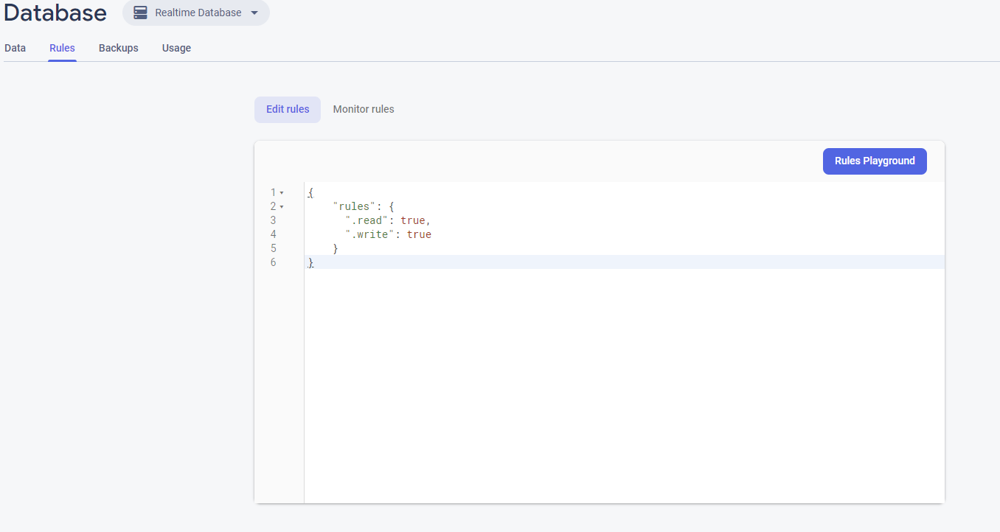

# Motivation
<b>fireReactRTC</b> is a finger-snapping fast to implement react component for webRTC in ReactJS with Firebase as backend.


# Run
First clone the repository and install the node modules
```bash
npm install
```

Then create a new project on [firebase](https://console.firebase.google.com/) along with a database.

Then navigate to the Realtime Database menu and override  the rules

```firebase
{
    "rules": {
      ".read": true,
      ".write": true
    }
}
```



Once you done there navigate to the app settings then copy yours and replace the ones from <b>firebase.js</b>


```
npm start
```
Knock yourself up! In the near future I'll improve its design. 

